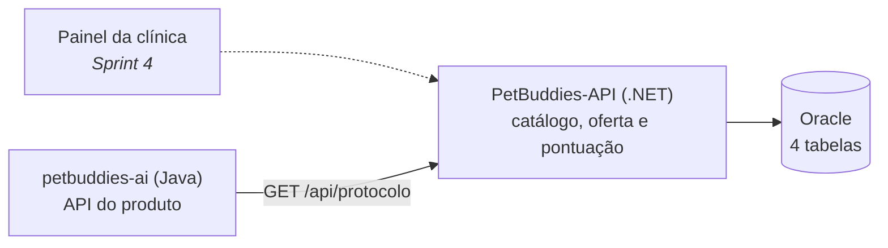
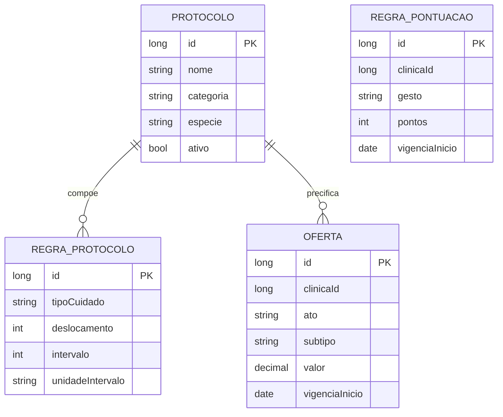

# PetBuddies API — Challenge FIAP 2026 | .NET

API REST desenvolvida com ASP.NET Core e EF Core — Challenge de **Advanced Business Development with .NET (2TDS)**, FIAP 2026.

O serviço é o **back-office administrativo da clínica veterinária**: é onde se configura o catálogo de protocolos de cuidado, o que a clínica oferece e por quanto, e quanto cada gesto do tutor vale em pontos. O `petbuddies-ai` (Java) consome o catálogo daqui por HTTP ao montar o plano de cuidado de um animal.



Preço e pontuação são política configurada: nesta sprint o CRUD existe e é validado, e nenhuma aplicação ainda lê essas tabelas para cobrar ou pontuar.

---

## Links

| | |
|---|---|
| Deploy | *pendente* |
| Swagger UI (local) | `http://localhost:5297/swagger` |
| Postman collection | [`docs/postman/petbuddies-api-net.postman_collection.json`](docs/postman/petbuddies-api-net.postman_collection.json) — **desatualizada** (ver [Como Testar](#como-testar)) |
| Vídeo de apresentação | *pendente* |

---

## Integrantes do Grupo

| Nome | RM |
|------|----|
| Felipe Yuiti Ishii | 565339 |
| Gabriel Nogueira Peixoto | 563925 |
| Giovanna Neri dos Santos | 566154 |
| Mariana Inoue | 565834 |

---

## Stack e Dependências

| Pacote | Versão | Descrição |
|--------|--------|-----------|
| Microsoft.EntityFrameworkCore | 8.0.26 | ORM principal |
| Oracle.EntityFrameworkCore | 8.23.26200 | Driver Oracle para EF Core |
| Microsoft.AspNetCore.Authentication.JwtBearer | 8.0.26 | Validação do JWT emitido pelo Java |
| Serilog.AspNetCore | 8.0.3 | Log estruturado (console + arquivo JSON compacto) |
| OpenTelemetry.Extensions.Hosting + instrumentações (AspNetCore, Http, EntityFrameworkCore) | 1.18.0 / 1.18.0-beta.1 | Tracing e métricas |
| AspNetCore.HealthChecks.Oracle | 8.0.1 | Health check de conexão com o Oracle |
| AspNetCore.HealthChecks.Uris | 8.0.1 | Health check do serviço Java (`/actuator/health`) |
| Swashbuckle.AspNetCore + Annotations | 6.6.2 | Swagger / OpenAPI UI |

**Testes** (só nos projetos `.Tests.*`): xUnit 2.9.3, Moq 4.20.72, Microsoft.EntityFrameworkCore.InMemory 8.0.26, Microsoft.AspNetCore.Mvc.Testing 8.0.26.

---

## Estrutura do Projeto

```
PetBuddies-API/
├── docs/
│   └── postman/
│       └── petbuddies-api-net.postman_collection.json
├── PetBuddies-API/
│   ├── Domain/
│   │   ├── Entities/        # BaseEntity + 4 entidades (Protocolo, RegraProtocolo, Oferta, RegraPontuacao)
│   │   ├── Enums/           # 7 enums de domínio
│   │   └── Interfaces/      # Contratos de repositório (IUnitOfWork, IXxxRepository)
│   ├── Application/
│   │   ├── Dtos/            # Um subpacote por domínio: XxxDto + SalvarXxxRequest
│   │   ├── Interfaces/      # Contratos de service (IXxxService)
│   │   └── UseCases/        # Services — validação de shape + regra de negócio
│   ├── Infrastructure/
│   │   ├── Data/
│   │   │   ├── ApplicationContext.cs
│   │   │   ├── Configurations/  # IEntityTypeConfiguration<T>, um por entidade
│   │   │   ├── Converters/
│   │   │   ├── Migrations/      # Migrations EF Core
│   │   │   └── UnitOfWork.cs
│   │   ├── Repositories/    # Um repositório por domínio
│   │   └── Security/
│   │       └── JwtOptions.cs
│   ├── Presentation/
│   │   ├── Controllers/     # 4 controllers REST, um por domínio
│   │   ├── Middlewares/
│   │   │   └── CorrelacaoMiddleware.cs
│   │   └── HealthCheckResponseWriter.cs
│   ├── appsettings.json
│   ├── appsettings.Development.json
│   └── Program.cs
├── PetBuddies-API.Tests.Unit/          # Repository + Service, EF Core InMemory + Moq
├── PetBuddies-API.Tests.Integration/   # Controller (Service mockado) + Autenticação (app real)
├── docker-compose.yml       # Sobe só o Oracle de desenvolvimento
├── Dockerfile
└── README.md
```

---

## Como Executar

### Pré-requisitos

- .NET 8 SDK
- Docker (para o Oracle de desenvolvimento) **ou** acesso ao Oracle FIAP

### 1. Banco de dados

O `docker-compose.yml` sobe **só o Oracle** — a aplicação roda no terminal, onde o log fica visível e o restart é imediato. A porta é `1522`; o serviço Java usa `1521`. Cada serviço tem o próprio schema — nenhum objeto de um existe no banco do outro.

```bash
docker compose up -d          # sobe o banco
docker compose down -v        # derruba e apaga o volume
```

Alternativa: preencher `ConnectionStrings:Oracle` em `PetBuddies-API/appsettings.Development.json` com o Oracle FIAP (`User Id` = seu RM, `Password` = a senha do Oracle FIAP).

### 2. Variáveis de ambiente

`.env.example` é o molde das variáveis que a configuração do ASP.NET Core lê do ambiente (`__` separa seção de chave). **Nada no projeto carrega `.env` automaticamente** — exporte no shell antes de rodar, ou preencha os mesmos valores em `appsettings.Development.json` / user-secrets:

```bash
cp .env.example .env
export $(grep -v '^#' .env | xargs)   # ou exporte manualmente, ou use user-secrets
```

| Variável | Para quê |
|---|---|
| `ConnectionStrings__Oracle` | connection string Oracle |
| `MotorApi__BaseUrl` | endereço do `petbuddies-ai` (Java) — usado **só** pelo health check `/health/externo` |
| `PETBUDDIES_JWT_SECRET` | segredo HS256 compartilhado com o Java, mínimo 32 caracteres. Sem ele a subida falha (`ValidateOnStart`) |

Em desenvolvimento local, a connection string já vem preenchida em `appsettings.Development.json` (Oracle do `docker-compose.yml`) — só `PETBUDDIES_JWT_SECRET` precisa ser exportado para a aplicação subir.

### 3. Rodando

```bash
dotnet run --project PetBuddies-API
```

No startup, `Program.cs` executa `Database.Migrate()` e aplica as migrations pendentes.

A aplicação sobe em:
- **HTTP:** `http://localhost:5297`
- **Swagger UI:** `http://localhost:5297/swagger`

---

## Modelo de Dados



`RegraPontuacao` não se relaciona com as demais: pontua o gesto do tutor, não o catálogo.

### Entidades e Tabelas — 4 tabelas

| Entidade | Tabela | Relacionamentos | Papel |
|----------|--------|-----------------|-------|
| `ProtocoloEntity` | `T_PB_PROTOCOLO` | 1:N → `RegraProtocolo` | catálogo de protocolos de cuidado |
| `RegraProtocoloEntity` | `T_PB_REGRA_PROTOCOLO` | N:1 → `Protocolo` | a regra de cada item do protocolo (tipo de cuidado, deslocamento, recorrência) |
| `OfertaEntity` | `T_PB_OFERTA` | N:1 → `Protocolo` (opcional) | o que a clínica oferece — procedimento, consulta ou protocolo inteiro — e por quanto, com vigência |
| `RegraPontuacaoEntity` | `T_PB_REGRA_PONTUACAO` | — | quanto cada gesto do tutor vale, por clínica e vigência |

`Oferta` e `RegraPontuacao` guardam `ClinicaId` sem FK — a clínica vive no banco do Java, e o serviço é single-tenant nesta sprint (`ClinicaId = 1`).

`BaseEntity` dá `CreatedAt`/`UpdatedAt` a `Protocolo`, `Oferta` e `RegraPontuacao`. `RegraProtocolo` não herda `BaseEntity` — é sempre reescrita junto do protocolo, nunca em si mesma.

### Regras de negócio que o schema espelha

- `Oferta`: `UX_OFERTA_VIGENCIA` (único por clínica + ato + subtipo/protocolo + início de vigência) e o `CHECK` `CK_OFERTA_ALVO` — ato `PROCEDIMENTO`/`CONSULTA` exige `Subtipo` e proíbe `ProtocoloId`; ato `PROTOCOLO` exige `ProtocoloId` e proíbe `Subtipo`.
- `RegraPontuacao`: `UK_PONTUACAO_VIGENCIA` (único por clínica + gesto + início de vigência).
- `RegraProtocolo`: `CK_REGPROT_RECORRENCIA` — `Intervalo` e `UnidadeIntervalo` são ambos nulos ou ambos preenchidos.

### Enums

| Enum | Valores |
|------|---------|
| `CategoriaProtocoloEnum` | `PREVENTIVO`, `POS_CIRURGICO` |
| `EspecieEnum` | `CACHORRO`, `GATO`, `PASSARO`, `COELHO`, `HAMSTER`, `OUTRO` |
| `TipoCuidadoEnum` | `VACINACAO`, `VERMIFUGACAO`, `EXAME`, `RETORNO`, `CIRURGIA`, `MEDICACAO`, `HIGIENE` |
| `UnidadeTempoEnum` | `DIAS`, `SEMANAS`, `MESES` |
| `TipoDataBaseEnum` | `NASCIMENTO`, `DATA_CIRURGIA`, `ULTIMA_REALIZACAO` |
| `TipoAtoOfertaEnum` | `PROCEDIMENTO`, `CONSULTA`, `PROTOCOLO` |
| `TipoGestoEnum` | `PLANO_CRIADO`, `CONSULTA_AGENDADA`, `CONSULTA_REALIZADA`, `PROCEDIMENTO_EXECUTADO` |

---

## Recursos e Rotas

> Todas as rotas exigem token JWT com role `VET` (`[Authorize(Roles = "VET")]`) — ver [Autenticação](#autenticação).

| Recurso | Rotas | Filtros de listagem | Status codes |
|---|---|---|---|
| Protocolo | `GET` `POST` `/api/protocolo`<br>`GET` `PUT` `DELETE` `/api/protocolo/{id}` | `especie`, `categoria`, `ativo` | `200` `201` `204` `400` `404` `409` |
| RegraProtocolo | `GET` `POST` `/api/regra-protocolo`<br>`GET` `PUT` `DELETE` `/api/regra-protocolo/{id}` | `protocoloId` (obrigatório na listagem) | `200` `201` `204` `400` `404` `409` |
| Oferta | `GET` `POST` `/api/oferta`<br>`GET` `PUT` `DELETE` `/api/oferta/{id}` | `clinicaId`, `ato` | `200` `201` `204` `400` `404` `409` |
| RegraPontuacao | `GET` `POST` `/api/regra-pontuacao`<br>`GET` `PUT` `DELETE` `/api/regra-pontuacao/{id}` | `clinicaId`, `gesto` | `200` `201` `204` `400` `404` `409` |

Listagem vazia devolve `204 No Content`; remoção de recurso com vínculo (FK) devolve `409 Conflict`. Erros são simples, sem envelope: `400 Bad Request`/`404 Not Found`/`409 Conflict` com uma mensagem de texto — shape ausente ou tipo errado no JSON é pego automaticamente pelo `[ApiController]` (DataAnnotations do request), e regra cruzada (ex.: alvo da oferta incoerente com o ato) é pega pelo `Validar()` de cada service, que devolve a mensagem de erro como `string?`.

Ao instanciar um plano de cuidado, o `petbuddies-ai` faz `GET` nesses endpoints para ler o catálogo vigente. O .NET não inicia chamadas para o Java — só o health check consulta o endereço dele, para reportar saúde.

---

## Autenticação

JWT **emitido pelo Java** (`POST /api/auth/login`, `issuer: petbuddies-ai`) e validado aqui com `AddAuthentication().AddJwtBearer()` (`Program.cs`). Sem Identity nesta sprint.

- Chave simétrica HS256, `PETBUDDIES_JWT_SECRET` (mínimo 32 caracteres) — mesmo segredo nos dois serviços.
- Role vem da claim `perfil` (`RoleClaimType = "perfil"`), valores `VET` e `TUTOR`.
- Toda rota de negócio é `[Authorize(Roles = "VET")]`; sem token → `401`, com token de `TUTOR` → `403`.
- As quatro rotas de health check são `AllowAnonymous`, propositalmente.

---

## Observabilidade

- **Serilog:** console (`[{Timestamp} {Level}] [{CorrelationId}] {Message}`) + arquivo JSON compacto em `logs/api-.log`, rotação diária, 7 dias de retenção.
- **Correlação de requisição** (`CorrelacaoMiddleware`, primeiro middleware do pipeline): usa o `TraceId` do rastreamento já ativo como identificador — nunca inventa um novo — e devolve `X-Correlation-Id` no header de resposta. Se o cliente mandou seu próprio `X-Correlation-Id`, ele entra como propriedade adicional do log, nunca substitui o identificador do rastreamento.
- **OpenTelemetry:** tracing (instrumentação de ASP.NET Core, `HttpClient` e Entity Framework Core) e métricas de ASP.NET Core (duração de requisição, contagem por status code). Sem `OTEL_EXPORTER_OTLP_ENDPOINT` configurado, exporta no console — é a única forma de ver um span localmente, sem coletor.
- **Application Insights:** a connection string é lida da configuração e logada como presente/ausente no startup, mas **não é usada** nesta sprint — gancho para a Sprint 4.

### Health Checks

Quatro rotas expostas por `Program.cs`, sem autenticação (`AllowAnonymous`):

| Rota | O que verifica | Quando falha |
|---|---|---|
| `/health/live` | o processo está de pé | nunca — não toca banco nem dependência externa |
| `/health/db` | conexão com o Oracle | Oracle fora do ar ou connection string vazia |
| `/health/externo` | `petbuddies-ai` (Java), via `GET /actuator/health` | motor Java fora do ar ou endereço não configurado |
| `/health` | as três verificações acima, juntas | qualquer uma delas |

```bash
curl http://localhost:5297/health
```

---

## Como Testar

### Via Swagger UI

Com o token JWT (emitido pelo Java) preenchido em **Authorize**, os 20 endpoints (5 por domínio × 4 domínios) estão disponíveis com "Try it out": `http://localhost:5297/swagger`.

### Via testes automatizados

Dois projetos xUnit, quatro domínios (`Protocolo`, `RegraProtocolo`, `Oferta`, `RegraPontuacao`) × camada, no padrão ensinado em aula — Repository, Service e Controller testados em separado, com o Controller isolando o Service via mock:

```
PetBuddies-API.Tests.Unit/
└── App/
    ├── {Protocolo,RegraProtocolo,Oferta,RegraPontuacao}RepositoryTest.cs   # EF Core InMemory
    └── {Protocolo,RegraProtocolo,Oferta,RegraPontuacao}ServiceTest.cs      # Moq sobre os repositórios

PetBuddies-API.Tests.Integration/
└── App/
    ├── {Protocolo,RegraProtocolo,Oferta,RegraPontuacao}ControllerTest.cs  # WebApplicationFactory + Service mockado (CustomWebApplicationFactory)
    └── AutenticacaoTest.cs                                                # app real, sem mock — sem token (401), token TUTOR (403), token VET (201)
```

Rodar tudo:

```bash
dotnet test
```

**86 testes, todos passando** (63 no `.Tests.Unit`, 23 no `.Tests.Integration` — conferido em 10/09/2026). Tudo roda contra `Microsoft.EntityFrameworkCore.InMemory`: não precisa de Oracle, VPN nem container.

Todo teste tem `[Trait]` de camada e domínio — dá para rodar só um recorte:

```bash
dotnet test --filter "Repository=Protocolo"
dotnet test --filter "Service=Oferta"
dotnet test --filter "Controller=RegraPontuacao"
dotnet test --filter "Autenticacao=Protocolo"
```

### Via Postman

A coleção em `docs/postman/petbuddies-api-net.postman_collection.json` ainda cobre recursos do registro clínico, que hoje vivem no Java. Está **desatualizada** — use o Swagger até uma coleção nova dos quatro domínios ser publicada.

---

## Exemplos de Payload (POST)

> Todas as rotas exigem `Authorization: Bearer <token com role VET>`.

#### `POST /api/protocolo`
```json
{
  "nome": "Preventivo cão adulto",
  "categoria": "PREVENTIVO",
  "especie": "CACHORRO",
  "ativo": true,
  "descricao": "Vacinação e vermifugação anuais"
}
```

#### `POST /api/regra-protocolo`
```json
{
  "protocoloId": 1,
  "tipo": "VACINACAO",
  "nome": "V10 anual",
  "offset": 0,
  "unidadeOffset": "DIAS",
  "dataBase": "ULTIMA_REALIZACAO",
  "intervalo": 12,
  "unidadeIntervalo": "MESES",
  "repeticoes": 1,
  "descricao": "Reforço anual da V10"
}
```

#### `POST /api/oferta`
> `subtipo` + `protocoloId` são mutuamente exclusivos: `ato: PROTOCOLO` exige `protocoloId` e proíbe `subtipo`; `PROCEDIMENTO`/`CONSULTA` exigem `subtipo` e proíbem `protocoloId`.
```json
{
  "clinicaId": 1,
  "ato": "PROTOCOLO",
  "protocoloId": 1,
  "descricao": "Plano preventivo cão adulto",
  "valor": 180.00,
  "inicioVigencia": "2026-10-01"
}
```

#### `POST /api/regra-pontuacao`
```json
{
  "clinicaId": 1,
  "gesto": "CONSULTA_REALIZADA",
  "pontos": 10,
  "inicioVigencia": "2026-10-01"
}
```
