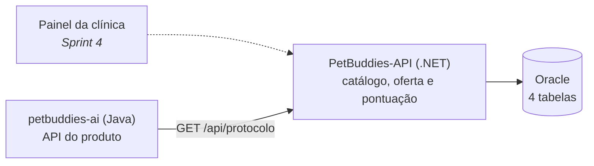
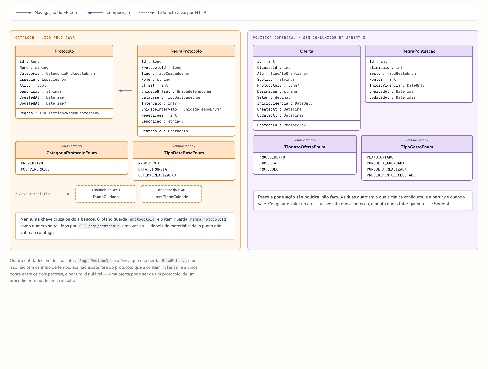

# PetBuddies API — Challenge FIAP 2026 | .NET

API REST desenvolvida com ASP.NET Core e EF Core — Challenge de **Advanced Business Development with .NET (2TDS)**, FIAP 2026.

O serviço é o **back-office administrativo da clínica veterinária**: é onde se configura o catálogo de protocolos de cuidado, o que a clínica oferece e por quanto, e quanto cada gesto do tutor vale em pontos. O `petbuddies-ai` (Java) consome o catálogo daqui por HTTP ao montar o plano de cuidado de um animal.



Preço e pontuação são política configurada: nesta sprint o CRUD existe e é validado, e nenhuma aplicação ainda lê essas tabelas para cobrar ou pontuar.

---

## Índice

1. [Integrantes do Grupo](#integrantes-do-grupo)
2. [Stack e Dependências](#stack-e-dependências)
3. [Estrutura do Projeto](#estrutura-do-projeto)
4. [Como Executar](#como-executar)
5. [Modelo de dados](#modelo-de-dados)
6. [Recursos e Rotas](#recursos-e-rotas)
7. [Autenticação](#autenticação)
8. [Observabilidade](#observabilidade)
9. [Como Testar](#como-testar)
10. [Exemplos de Payload (POST)](#exemplos-de-payload-post)

---

## Links

| | |
|---|---|
| Swagger UI (local) | `http://localhost:5297/swagger` |
| Postman collection | [`docs/postman/petbuddies-api-net.postman_collection.json`](docs/postman/petbuddies-api-net.postman_collection.json) |
| Serviço Java (opcional para avaliar este) | [3BugBuddies/PetBuddies-AI](https://github.com/3BugBuddies/PetBuddies-AI) |

---

## Integrantes do Grupo

| Nome | RM |
|------|----|
| Felipe Yuiti Ishii | 565339 |
| Gabriel Nogueira Peixoto | 563925 |
| Giovanna Neri dos Santos | 566154 |
| Mariana Inoue | 565834 |

---

## Stack e Dependências

| Pacote | Versão | Descrição |
|--------|--------|-----------|
| Microsoft.EntityFrameworkCore | 8.0.26 | ORM principal |
| Oracle.EntityFrameworkCore | 8.23.26200 | Driver Oracle para EF Core |
| Microsoft.AspNetCore.Authentication.JwtBearer | 8.0.26 | Validação do JWT emitido pelo Java |
| Serilog.AspNetCore | 8.0.3 | Log estruturado (console + arquivo JSON compacto) |
| OpenTelemetry.Extensions.Hosting + instrumentações (AspNetCore, Http, EntityFrameworkCore) | 1.18.0 / 1.18.0-beta.1 | Tracing e métricas |
| AspNetCore.HealthChecks.Oracle | 8.0.1 | Health check de conexão com o Oracle |
| AspNetCore.HealthChecks.Uris | 8.0.1 | Health check do serviço Java (`/actuator/health`) |
| Swashbuckle.AspNetCore + Annotations | 6.6.2 | Swagger / OpenAPI UI |

**Testes** (só nos projetos `.Tests.*`): xUnit 2.9.3, Moq 4.20.72, Microsoft.EntityFrameworkCore.InMemory 8.0.26, Microsoft.AspNetCore.Mvc.Testing 8.0.26.

---

## Estrutura do Projeto

```
PetBuddies-API/
├── docs/
│   └── postman/
│       └── petbuddies-api-net.postman_collection.json
├── PetBuddies-API/
│   ├── Domain/
│   │   ├── Entities/        # BaseEntity + 4 entidades (Protocolo, RegraProtocolo, Oferta, RegraPontuacao)
│   │   ├── Enums/           # 7 enums de domínio
│   │   └── Interfaces/      # Contratos de repositório (IXxxRepository)
│   ├── Application/
│   │   ├── Dtos/            # Um subpacote por domínio: XxxDto + SalvarXxxRequest
│   │   ├── Interfaces/      # Contratos de service (IXxxService)
│   │   ├── Mappers/         # Entidade ↔ DTO, um por domínio
│   │   └── UseCases/        # Services — validação de shape + regra de negócio
│   ├── Infrastructure/
│   │   ├── Data/
│   │   │   ├── ApplicationContext.cs
│   │   │   ├── Configurations/  # IEntityTypeConfiguration<T>, um por entidade
│   │   │   ├── Converters/
│   │   │   └── Migrations/      # Migrations EF Core
│   │   ├── IoC/
│   │   │   └── Bootstrap.cs     # Injeção de dependência, Serilog e OpenTelemetry
│   │   ├── Repositories/    # Um repositório por domínio
│   │   └── Security/
│   │       └── JwtOptions.cs
│   ├── Presentation/
│   │   ├── Controllers/     # 4 controllers REST, um por domínio, o HealthController e o TokenDevController
│   │   ├── Conventions/
│   │   │   └── ApenasEmDesenvolvimento.cs  # tira o TokenDevController das rotas fora de Development
│   │   ├── Middlewares/
│   │   │   └── CorrelacaoMiddleware.cs
│   │   └── HealthCheckResponseWriter.cs
│   ├── appsettings.json
│   ├── appsettings.Development.json
│   └── Program.cs
├── PetBuddies-API.Tests.Unit/          # Repository, Service e Mapper — EF Core InMemory + Moq
├── PetBuddies-API.Tests.Integration/   # Controller (Service mockado) + Autenticação (app real)
├── docker-compose.yml       # Sobe só o Oracle de desenvolvimento
├── Dockerfile
└── README.md
```

---

## Como Executar

### Pré-requisitos

- .NET 8 SDK
- Docker (para o Oracle de desenvolvimento) **ou** acesso ao Oracle FIAP

### 1. Banco de dados

O `docker-compose.yml` sobe **só o Oracle** — a aplicação roda no terminal, onde o log fica visível e o restart é imediato. A porta é `1522`; o serviço Java usa `1521`. Cada serviço tem o próprio schema — nenhum objeto de um existe no banco do outro.

```bash
docker compose up -d          # sobe o banco
docker compose down -v        # derruba e apaga o volume
```

Alternativa: o Oracle FIAP, exportando `ConnectionStrings__Oracle` (passo 2) com `User Id` = seu RM e `Password` = a senha do Oracle FIAP.

### 2. Variáveis de ambiente

**Para rodar localmente, nenhuma.** O `appsettings.Development.json` já traz a connection string do
Oracle do `docker-compose.yml` e um `PETBUDDIES_JWT_SECRET` de desenvolvimento. Esse arquivo só é
lido em `Development`: em qualquer outro ambiente o segredo precisa vir da variável, e sem ela a
subida falha (`ValidateOnStart`).

Exporte só para trocar um desses valores — a variável de ambiente vence o arquivo (`__` separa seção de chave):

| Variável | Quando exportar |
|---|---|
| `ConnectionStrings__Oracle` | para usar o Oracle FIAP no lugar do container |
| `PETBUDDIES_JWT_SECRET` | para aceitar o token do Java: o valor precisa ser o mesmo configurado lá, com no mínimo 32 caracteres |
| `MotorApi__BaseUrl` | se o Java não estiver em `http://localhost:8080` — usado **só** pelo health check `/health/externo` |

```bash
export ConnectionStrings__Oracle='Data Source=oracle.fiap.com.br:1521/ORCL;User Id=<RM>;Password=<senha>'
```

Use aspas simples: a connection string tem espaço, e sem elas o shell a corta em `Data`.

### 3. Rodando

```bash
dotnet run --project PetBuddies-API
```

No startup, `Program.cs` executa `Database.Migrate()` e aplica as migrations pendentes.

A aplicação sobe em:
- **HTTP:** `http://localhost:5297`
- **Swagger UI:** `http://localhost:5297/swagger`

### 4. Pegue um token

Toda rota de negócio exige token, e **não é preciso subir o Java para isso**: a própria API emite
um token de desenvolvimento.

```bash
curl -s -X POST http://localhost:5297/api/dev/token | jq -r .token
```

No Swagger e no Postman o caminho é o mesmo — detalhe em [Autenticação](#autenticação).

---

## Modelo de dados



Quatro entidades, agrupadas pelos dois papéis do serviço. O **catálogo** é lido pelo Java por
HTTP no instante em que um plano de cuidado nasce; a **política comercial** ainda não tem
consumidor — preço e pontuação são configuração, e congelar o valor no ato é Sprint 4.

| Entidade | Tabela | Papel |
|---|---|---|
| `ProtocoloEntity` | `T_PB_PROTOCOLO` | o molde de cuidado: categoria e espécie a que se aplica |
| `RegraProtocoloEntity` | `T_PB_REGRA_PROTOCOLO` | o item do molde — tipo de cuidado, deslocamento, data-base e recorrência |
| `OfertaEntity` | `T_PB_OFERTA` | o que a clínica oferece e por quanto, com vigência |
| `RegraPontuacaoEntity` | `T_PB_REGRA_PONTUACAO` | quanto cada gesto do tutor vale, por clínica e vigência |

Três coisas que o desenho mostra e a tabela não mostra:

- **Nenhuma chave cruza os dois bancos.** O plano e o item do lado Java guardam `protocoloId` e
  `regraProtocoloId` como número solto, lidos uma vez por `GET /api/protocolo`. Depois de
  materializado, o plano não volta ao catálogo.
- **`RegraProtocolo` é a única sem carimbo de tempo**, porque é a única que não herda
  `BaseEntity` — ela não existe fora do protocolo que a contém.
- **`Oferta` é a única ponte entre os dois pacotes**, por um id nulável: a oferta pode ser de um
  protocolo, de um procedimento ou de uma consulta.

Os quatro enums próprios do serviço estão no desenho. `EspecieEnum`, `TipoCuidadoEnum` e
`UnidadeTempoEnum` aparecem como tipo de campo e não estão expandidos: são **vocabulário
compartilhado com o Java**, e os valores precisam bater nos dois lados — a lista vive em
`Domain/Enums/`.

### Invariantes que o schema garante

- `Oferta` — `UX_OFERTA_VIGENCIA` (único por clínica + ato + subtipo/protocolo + início de
  vigência) e o `CHECK` `CK_OFERTA_ALVO`: ato `PROCEDIMENTO`/`CONSULTA` exige `Subtipo` e proíbe
  `ProtocoloId`; ato `PROTOCOLO` faz o inverso.
- `RegraPontuacao` — `UK_PONTUACAO_VIGENCIA` (único por clínica + gesto + início de vigência).
- `RegraProtocolo` — `CK_REGPROT_RECORRENCIA`: `Intervalo` e `UnidadeIntervalo` são ambos nulos
  ou ambos preenchidos.

A fonte do desenho é `.claude/docs/dotnet-sprint-3/diagrama-classes/diagrama-classes.html`, que
não é versionada — o PNG é o entregável.

---

## Recursos e Rotas

> Todas as rotas exigem token JWT com role `VET` (`[Authorize(Roles = "VET")]`) — ver [Autenticação](#autenticação).

| Recurso | Rotas | Filtros de listagem | Status codes |
|---|---|---|---|
| Protocolo | `GET` `POST` `/api/protocolo`<br>`GET` `PUT` `DELETE` `/api/protocolo/{id}` | `especie`, `categoria`, `ativo` | `200` `201` `204` `400` `404` `409` |
| RegraProtocolo | `GET` `POST` `/api/regra-protocolo`<br>`GET` `PUT` `DELETE` `/api/regra-protocolo/{id}` | `protocoloId` (obrigatório na listagem) | `200` `201` `204` `400` `404` `409` |
| Oferta | `GET` `POST` `/api/oferta`<br>`GET` `PUT` `DELETE` `/api/oferta/{id}` | `clinicaId`, `ato` | `200` `201` `204` `400` `404` `409` |
| RegraPontuacao | `GET` `POST` `/api/regra-pontuacao`<br>`GET` `PUT` `DELETE` `/api/regra-pontuacao/{id}` | `clinicaId`, `gesto` | `200` `201` `204` `400` `404` `409` |

Listagem vazia devolve `204 No Content`; remoção de recurso com vínculo (FK) devolve `409 Conflict`. Erros são simples, sem envelope: `400 Bad Request`/`404 Not Found`/`409 Conflict` com uma mensagem de texto — shape ausente ou tipo errado no JSON é pego automaticamente pelo `[ApiController]` (DataAnnotations do request), e regra cruzada (ex.: alvo da oferta incoerente com o ato) é pega pelo `Validar()` de cada service, que devolve a mensagem de erro como `string?`.

Ao instanciar um plano de cuidado, o `petbuddies-ai` faz `GET` nesses endpoints para ler o catálogo vigente.

> **O catálogo nasce povoado.** A migration `semear_catalogo_inicial` insere dois protocolos preventivos — um de cão e um de gato, com três regras cada — e roda sozinha na subida, porque `Database.Migrate()` é chamado no start. Sem isso o catálogo nasceria vazio, e o motor do Java leria isso como "nenhum protocolo compatível": mesma resposta de sucesso, sem erro e sem log.
 O .NET não inicia chamadas para o Java — só o health check consulta o endereço dele, para reportar saúde.

---

## Autenticação

**Este serviço não emite token — ele valida o que o Java emite.** Não há `POST /api/auth/login`
aqui: o `AddAuthentication().AddJwtBearer()` (`Program.cs`) confere assinatura, emissor e perfil
de um JWT `HS256` assinado com `PETBUDDIES_JWT_SECRET`, **o mesmo segredo nos dois serviços**.
Sem Identity nesta sprint.

- Emissor exigido: `petbuddies-ai`. Role vem da claim `perfil` (`RoleClaimType = "perfil"`).
- Toda rota de negócio é `[Authorize(Roles = "VET")]`: sem token → `401`, token de `TUTOR` → `403`.
- `/health/*` e `/metrics` são `AllowAnonymous`, propositalmente.

### Como obter um token

> **Para avaliar este serviço não é preciso subir o Java.** Com a API rodando por `dotnet run`, ela
> mesma emite o token em `POST /api/dev/token`.

**Terminal:**

```bash
TOKEN=$(curl -s -X POST http://localhost:5297/api/dev/token | jq -r .token)
curl -s http://localhost:5297/api/protocolo -H "Authorization: Bearer $TOKEN"
```

**Swagger** (`http://localhost:5297/swagger`):

1. Abra o grupo **TokenDev** → `POST /api/dev/token` → **Try it out** → **Execute**.
2. Copie o valor de `token` da resposta.
3. Clique em **Authorize** e cole só o token — o prefixo `Bearer` é colocado pela página.

**Postman:** nada a fazer. Qualquer requisição da coleção pede o token à API sozinha quando a
variável `token` está vazia ou vencida; a pasta `0 · Token` faz o mesmo de forma explícita.

O token vale 8 horas e é assinado com o mesmo `PETBUDDIES_JWT_SECRET` que a API valida — em
`Development`, o valor que já vem no `appsettings.Development.json`, sem nada a configurar.
`?perfil=TUTOR` emite um token do outro perfil, útil para ver o `403`.

**A rota só existe em `Development`.** O `dotnet run` usa o perfil do `launchSettings.json`, que já
define `Development` mesmo que o shell tenha outro valor. Em qualquer outro ambiente a rota responde
`404` e some do Swagger: em produção o serviço só valida o token que o Java emite.

**Com o Java no ar**, o login dele também serve, desde que os dois serviços usem o mesmo
`PETBUDDIES_JWT_SECRET` (passo 2 de [Como Executar](#como-executar)) — o emissor já é o mesmo. Como subir o Java e os usuários de demonstração
estão no README do [PetBuddies-AI](https://github.com/3BugBuddies/PetBuddies-AI); no Postman, é a
pasta `7 · Login no Java (opcional)`.

---

## Observabilidade

- **Serilog:** console (`[{Timestamp} {Level}] [{CorrelationId}] {Message}`) + arquivo JSON compacto em `logs/api-.log`, rotação diária, 7 dias de retenção.
- **Correlação de requisição** (`CorrelacaoMiddleware`, primeiro middleware do pipeline): usa o `TraceId` do rastreamento já ativo como identificador — nunca inventa um novo — e devolve `X-Correlation-Id` no header de resposta. Se o cliente mandou seu próprio `X-Correlation-Id`, ele entra como propriedade adicional do log, nunca substitui o identificador do rastreamento.
- **Nível de log pela resposta:** a linha de conclusão de cada requisição escolhe o nível pelo status já calculado:

  | Status | Nível |
  |---|---|
  | 500 ou mais (inclui exceção não tratada) | `Error` |
  | 400 a 499 | `Warning` |
  | demais | `Information` |

- **OpenTelemetry:** tracing (instrumentação de ASP.NET Core, `HttpClient` e Entity Framework Core) e métricas de ASP.NET Core (duração de requisição, contagem por status code). Sem `OTEL_EXPORTER_OTLP_ENDPOINT` configurado, **o tracing** exporta no console — é a única forma de ver um span sem coletor. **A métrica não vai para o console:** o despejo periódico dela ocupava metade do log, e o `/metrics` entrega o mesmo dado quando alguém pede.
- **O console não rastreia infraestrutura.** Requisições a `/health/*` e `/metrics` ficam fora do tracing: são chamadas de máquina, repetidas em laço, e afogariam as requisições que interessam. Elas continuam contando nas métricas — o `/metrics` mostra a linha delas por rota.
- **Métricas em `GET /metrics`**, no formato de texto do Prometheus, sem autenticação. Esse caminho está **sempre ligado**, independente de coletor: é o que torna as métricas legíveis sem depender de nada externo.

### Como monitorar

```bash
curl localhost:5297/metrics
```

**Tempo de resposta** — soma e contagem por rota e status; a média é a divisão das duas:

```
http_server_request_duration_seconds_sum{http_request_method="GET",http_response_status_code="200",...}
http_server_request_duration_seconds_count{http_request_method="GET",http_response_status_code="200",...}
```

**Taxa de erro** — a mesma métrica, agrupada pela dimensão de status:

```bash
curl -s localhost:5297/metrics | grep -oE 'http_response_status_code="[0-9]+"' | sort | uniq -c
```

Nada disso exige instrumento próprio: `AddAspNetCoreInstrumentation()` já produz as duas.

Além do endpoint:

- A cada requisição, o console mostra o span (`Activity.TraceId`, rota, status).
- O `TraceId` do span é o mesmo valor do cabeçalho `X-Correlation-Id` e do `CorrelationId` em `logs/api-*.log` — com ele se acha a requisição nos três lugares.
- Para mandar a um coletor externo, basta definir `OTEL_EXPORTER_OTLP_ENDPOINT`; o `/metrics` continua respondendo do mesmo jeito.

### Health Checks

Quatro rotas expostas por `Program.cs`, sem autenticação (`AllowAnonymous`):

| Rota | O que verifica | Quando falha |
|---|---|---|
| `/health/live` | o processo está de pé | nunca — não toca banco nem dependência externa |
| `/health/db` | conexão com o Oracle | Oracle fora do ar ou connection string vazia |
| `/health/externo` | `petbuddies-ai` (Java), via `GET /actuator/health` | motor Java fora do ar ou endereço não configurado |
| `/health` | as três verificações acima, juntas | qualquer uma delas |

```bash
curl http://localhost:5297/health
```

O `HealthController` expõe as mesmas três verificações em `/api/health/live`, `/api/health/db` e
`/api/health/externo` — também sem autenticação, `200` quando saudável e `503` quando não. O corpo
usa um contrato diferente do de `/health/*`: `name`, `status` e `description` (mais `error` quando há
exceção), enquanto `/health/*` usa `nome`, `status` e `descricao`.

---

## Como Testar

### Via Swagger UI

Com o token de `POST /api/dev/token` preenchido em **Authorize** (passo a passo em [Como obter um token](#como-obter-um-token)), os 20 endpoints (5 por domínio × 4 domínios) estão disponíveis com "Try it out": `http://localhost:5297/swagger`.

### Via testes automatizados

Dois projetos xUnit, quatro domínios (`Protocolo`, `RegraProtocolo`, `Oferta`, `RegraPontuacao`) × camada, no padrão ensinado em aula — Repository, Service e Controller testados em separado, com o Controller isolando o Service via mock:

```
PetBuddies-API.Tests.Unit/
└── App/
    ├── {Protocolo,RegraProtocolo,Oferta,RegraPontuacao}RepositoryTest.cs   # EF Core InMemory
    ├── {Protocolo,RegraProtocolo,Oferta,RegraPontuacao}ServiceTest.cs      # Moq sobre os repositórios
    └── OfertaMapperTest.cs                                                 # OfertaMapper.Aplicar, sem repositório

PetBuddies-API.Tests.Integration/
└── App/
    ├── {Protocolo,RegraProtocolo,Oferta,RegraPontuacao}ControllerTest.cs  # WebApplicationFactory + Service mockado (CustomWebApplicationFactory)
    └── AutenticacaoTest.cs                                                # app real, sem mock — sem token (401), token TUTOR (403), token VET (201)
```

O Domínio (`Domain/Entities/*`) não tem teste próprio: as entidades são estrutura de dados, sem
comportamento próprio. A regra de negócio vive nos casos de uso da camada de Aplicação, e é lá que
os `*ServiceTest` com Moq cobrem.

Rodar tudo:

```bash
dotnet test
```

**86 testes, todos passando** (63 no `.Tests.Unit`, 23 no `.Tests.Integration` — conferido em 12/09/2026). Tudo roda contra `Microsoft.EntityFrameworkCore.InMemory`: não precisa de Oracle, VPN nem container.

Todo teste tem `[Trait]` de camada e domínio — dá para rodar só um recorte:

```bash
dotnet test --filter "Repository=Protocolo"
dotnet test --filter "Service=Oferta"
dotnet test --filter "Mapper=Oferta"
dotnet test --filter "Controller=RegraPontuacao"
dotnet test --filter "Autenticacao=Protocolo"
```

### Via Postman

A coleção em `docs/postman/petbuddies-api-net.postman_collection.json` cobre os quatro domínios do back-office.

- Importe o arquivo.
- Com a API e o Oracle de pé, rode a coleção inteira em ordem — ou qualquer requisição avulsa. O token é pedido à própria API e gravado sozinho, pela pasta `0 · Token` ou, se a variável estiver vazia ou vencida, pelo script da coleção. Não há segredo para configurar no Postman.
- O que cada pasta cobre: `1 · Saúde` as sete rotas de health check; `2 · Protocolo`, `3 · Regra de protocolo`, `4 · Oferta` e `5 · Regra de pontuação` o CRUD de cada domínio, com os erros que o controller declara; `6 · Limpeza` remove o que a execução criou.
- `7 · Login no Java (opcional)` só responde com o `petbuddies-ai` no ar; sem ele, essa requisição falha e pode ser ignorada.

---

## Exemplos de Payload (POST)

> Todas as rotas exigem `Authorization: Bearer <token com role VET>`.

#### `POST /api/protocolo`
```json
{
  "nome": "Preventivo cão adulto",
  "categoria": "PREVENTIVO",
  "especie": "CACHORRO",
  "ativo": true,
  "descricao": "Vacinação e vermifugação anuais"
}
```

#### `POST /api/regra-protocolo`
```json
{
  "protocoloId": 1,
  "tipo": "VACINACAO",
  "nome": "V10 anual",
  "offset": 0,
  "unidadeOffset": "DIAS",
  "dataBase": "ULTIMA_REALIZACAO",
  "intervalo": 12,
  "unidadeIntervalo": "MESES",
  "repeticoes": 1,
  "descricao": "Reforço anual da V10"
}
```

#### `POST /api/oferta`
> `subtipo` + `protocoloId` são mutuamente exclusivos: `ato: PROTOCOLO` exige `protocoloId` e proíbe `subtipo`; `PROCEDIMENTO`/`CONSULTA` exigem `subtipo` e proíbem `protocoloId`.
```json
{
  "clinicaId": 1,
  "ato": "PROTOCOLO",
  "protocoloId": 1,
  "descricao": "Plano preventivo cão adulto",
  "valor": 180.00,
  "inicioVigencia": "2026-10-01"
}
```

#### `POST /api/regra-pontuacao`
```json
{
  "clinicaId": 1,
  "gesto": "CONSULTA_REALIZADA",
  "pontos": 10,
  "inicioVigencia": "2026-10-01"
}
```
